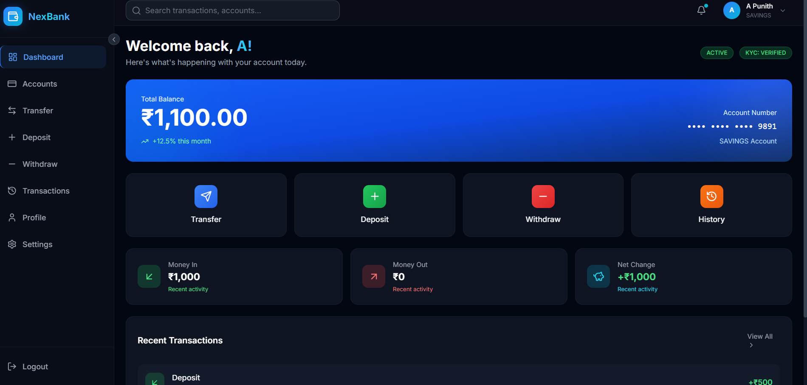

# 🏦 Nex-Gen Banking Application - Backend API

A modern, secure RESTful banking API built with Spring Boot 4.0.1, featuring JWT authentication, Razorpay payment integration, and comprehensive banking operations.


---

## 📋 Table of Contents

- [Features](#-features)
- [Tech Stack](#-tech-stack)
- [Project Structure](#-project-structure)
- [Prerequisites](#-prerequisites)
- [Installation](#-installation)
- [Configuration](#-configuration)
- [API Endpoints](#-api-endpoints)
- [Security](#-security)
- [Running the Application](#-running-the-application)
- [Testing](#-testing)

---

## ✨ Features

- **🔐 User Authentication** - Secure registration and login with JWT tokens
- **🏧 Account Management** - Open and manage multiple bank accounts
- **💸 Fund Transfers** - Transfer money between accounts seamlessly
- **💰 Deposits** - Integrated Razorpay payment gateway for deposits
- **💳 Withdrawals** - Secure withdrawal functionality
- **📊 Transaction History** - Complete transaction tracking and history
- **🛡️ Spring Security** - Role-based access control and secure endpoints
- **✅ Data Validation** - Comprehensive input validation

---

## 🛠️ Tech Stack

| Technology | Version | Purpose |
|------------|---------|---------|
| **Java** | 17 | Programming Language |
| **Spring Boot** | 4.0.1 | Application Framework |
| **Spring Security** | Latest | Authentication & Authorization |
| **Spring Data JPA** | Latest | Database ORM |
| **MySQL** | 8.0+ | Relational Database |
| **JWT (jjwt)** | 0.11.5 | Token-based Authentication |
| **Razorpay SDK** | 1.4.3 | Payment Gateway Integration |
| **Lombok** | Latest | Boilerplate Code Reduction |
| **Maven** | 3.9+ | Build Tool |

---

## 📁 Project Structure

```
src/main/java/com/bank/banking_app/
├── 📄 BankingAppApplication.java    # Main application entry
├── 📁 config/                        # Configuration classes
│   ├── SecurityConfig.java          # Spring Security configuration
│   └── CorsConfig.java              # CORS settings
├── 📁 controller/                    # REST API controllers
│   ├── AuthController.java          # Authentication endpoints
│   ├── MeController.java            # User profile endpoints
│   ├── OpenAccountController.java   # Account opening
│   ├── PaymentController.java       # Razorpay payments
│   ├── TransactionController.java   # Transaction management
│   ├── TransactionHistoryController.java
│   ├── TransferController.java      # Fund transfers
│   └── WithDrawController.java      # Withdrawals
├── 📁 dto/                           # Data Transfer Objects
├── 📁 enums/                         # Enumerations
├── 📁 exception/                     # Custom exceptions
├── 📁 models/                        # JPA Entity classes
│   ├── Account.java
│   ├── Payment.java
│   ├── Transaction.java
│   └── Users.java
├── 📁 repository/                    # JPA Repositories
├── 📁 security/                      # Security utilities
├── 📁 service/                       # Business logic services
│   ├── AuthService.java
│   ├── DepositService.java
│   ├── MeService.java
│   ├── OpenAccountService.java
│   ├── RazorpayService.java
│   ├── TransactionHistoryService.java
│   ├── TransferService.java
│   └── WithDrawService.java
└── 📁 Transformer/                   # Entity-DTO transformers
```

---

## 📋 Prerequisites

Before running the application, ensure you have:

- ☕ **Java JDK 17** or higher
- 🗄️ **MySQL 8.0** or higher
- 📦 **Maven 3.9** or higher
- 🔑 **Razorpay Account** (for payment integration)

---

## ⚙️ Installation

1. **Clone the repository**
   ```bash
   git clone https://github.com/yourusername/banking-app.git
   cd banking-app
   ```

2. **Create MySQL database**
   ```sql
   CREATE DATABASE banking_db;
   ```

3. **Install dependencies**
   ```bash
   ./mvnw clean install
   ```

---

## 🔧 Configuration

### Application Properties

Update `src/main/resources/application.properties`:

```properties
# Application
spring.application.name=banking-app

# Database Configuration
spring.datasource.url=jdbc:mysql://localhost:3306/banking_db?createDatabaseIfNotExist=true
spring.datasource.username=root
spring.datasource.password=your_password

# JPA Settings
spring.jpa.hibernate.ddl-auto=update
spring.jpa.show-sql=true
spring.jpa.properties.hibernate.format_sql=true

# Razorpay Configuration
razorpay.key.id=your_razorpay_key_id
razorpay.key.secret=your_razorpay_key_secret
```

### Razorpay Setup

1. Create an account at [Razorpay Dashboard](https://dashboard.razorpay.com)
2. Navigate to `Settings > API Keys`
3. Generate your API keys
4. Update the configuration with your keys

---

## 🌐 API Endpoints

### Authentication

| Method | Endpoint | Description |
|--------|----------|-------------|
| `POST` | `/api/auth/register` | Register new user |
| `POST` | `/api/auth/login` | User login |

### User Profile

| Method | Endpoint | Description |
|--------|----------|-------------|
| `GET` | `/api/me` | Get current user profile |

### Account Management

| Method | Endpoint | Description |
|--------|----------|-------------|
| `POST` | `/api/account/open` | Open new bank account |
| `GET` | `/api/account` | Get account details |

### Transactions

| Method | Endpoint | Description |
|--------|----------|-------------|
| `POST` | `/api/transfer` | Transfer funds |
| `POST` | `/api/withdraw` | Withdraw funds |
| `GET` | `/api/transactions` | Get transaction history |

### Payments (Razorpay)

| Method | Endpoint | Description |
|--------|----------|-------------|
| `POST` | `/api/payment/create-order` | Create Razorpay order |
| `POST` | `/api/payment/verify` | Verify payment |

---

## 🔒 Security

### JWT Authentication

All protected endpoints require a valid JWT token in the Authorization header:

```http
Authorization: Bearer <your_jwt_token>
```

### Password Encryption

User passwords are encrypted using BCrypt algorithm.

### CORS Configuration

CORS is configured to allow requests from the frontend application running on `http://localhost:5173`.

---

## 🚀 Running the Application

### Development Mode

```bash
./mvnw spring-boot:run
```

The server will start at `http://localhost:8080`

### Production Build

```bash
./mvnw clean package
java -jar target/banking-app-0.0.1-SNAPSHOT.jar
```

---

## 🧪 Testing

Run the test suite:

```bash
./mvnw test
```

---


## 🤝 Contributing

1. Fork the repository
2. Create your feature branch (`git checkout -b feature/AmazingFeature`)
3. Commit your changes (`git commit -m 'Add some AmazingFeature'`)
4. Push to the branch (`git push origin feature/AmazingFeature`)
5. Open a Pull Request

---
```
images
```
```


```
<p align="center">Made with ❤️ using Spring Boot</p>
